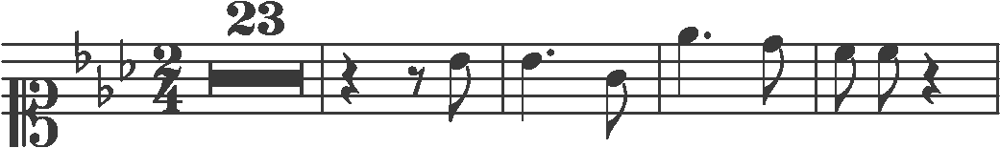

# Optical Music Recognition with CRNN in Jittor

[Files](#Files) | [Run Demo](#Run Demo) | [Train Model](#Train Model) | [Test Model](#Test Model) | [Chinese](./README.cn.md)

This repository implements Convolutional Recurrent Neural Network (CRNN, http://arxiv.org/abs/1507.05717) with [Jittor](https://cg.cs.tsinghua.edu.cn/jittor/) for optical music recognition task(OMR), with [huangb19/crnn_jittor](https://github.com/huangb19/crnn_jittor) being its counterpart. The model and the training codes are based on the [PyTorch version](https://github.com/meijieru/crnn.pytorch), and the [PrIMuS dataset](https://grfia.dlsi.ua.es/primus/) is used for training, validation and testing.

## Files

The model is defined in `model.py`, with `utils.py` defining other classes and functions. Two methods for loading data are provided in `dataset.py` , with `OMRDataset` loading data directly from files with low efficiency and`lmdbDataset`, created with `create_dataset.py`, to accelerate the reading process. Train and test model respectively in`train.py` and `test.py`. A demonstration of model inference is provided in `demo.py`.

## Run Demo

`example/model.pkl` is a model trained with distorted data(Camera PrIMuS). Run the command below for a demonstration:

```
python demo.py --imagePath example/000051652-1_2_1.png --modelPath example/model.pkl
```

Input demo: 

Expected output:

```
[['clef-C1', 'keySignature-EbM', 'timeSignature-2/4', '-', '-', '-', '-', '-', '-', '-', '-', '-', '-', '-', '-', '-', '-', '-', '-', '-', '-', 'multirest-23', '-', '-', '-', '-', '-', '-', '-', '-', '-', 'barline', 'barline', '-', 'rest-quarter', '-', '-', '-', '-', '-', '-', 'rest-eighth', '-', '-', '-', 'note-Bb4_eighth', '-', '-', '-', 'barline', 'barline', '-', 'note-Bb4_quarter.', '-', '-', '-', '-', '-', '-', '-', '-', 'note-G4_eighth', '-', '-', '-', 'barline', 'barline', '-', 'note-Eb5_quarter.', '-', '-', '-', '-', '-', '-', '-', 'note-D5_eighth', '-', '-', '-', '-', 'barline', '-', '-', 'note-C5_eighth', '-', '-', '-', 'note-C5_eighth', '-', '-', '-', 'rest-quarter', '-', '-', '-', '-', '-', '-', 'barline']] => ['clef-C1 keySignature-EbM timeSignature-2/4 multirest-23 barline rest-quarter rest-eighth note-Bb4_eighth barline note-Bb4_quarter. note-G4_eighth barline note-Eb5_quarter. note-D5_eighth barline note-C5_eighth note-C5_eighth rest-quarter barline']
```

## Train Model

Train with the [PrIMuS dataset](https://grfia.dlsi.ua.es/primus/), which can be downloaded from [https://grfia.dlsi.ua.es/primus/packages/CameraPrIMuS.tgz](https://grfia.dlsi.ua.es/primus/packages/CameraPrIMuS.tgz). After downloading and unzipping, place `Corpus` under `data` directory and set training/validation/test set in`train.txt, val.txt, test.txt `. For loading datasets, two ways are provided in `dataset.py`:

* Directly from files (which is slow):
  * Replace lines 59-68 with lines 70-83 in`train.py` and run `python train.py`.
* Lmdb dataset (fast, but requires manually creating datasets):
  * In `create_dataset.py`, fill the 80th line with the directory to save the dataset and the 82nd line with the file containing items to be loaded into the dataset, and run `python create_dataset.py` to get the dataset.
  * Run `python train.py --trainRoot {train path} --valRoot {val path}` after filling the paths for training and validation datasets.

## Test Model

Set model and dataset in `test.py` and run the script for the result.

